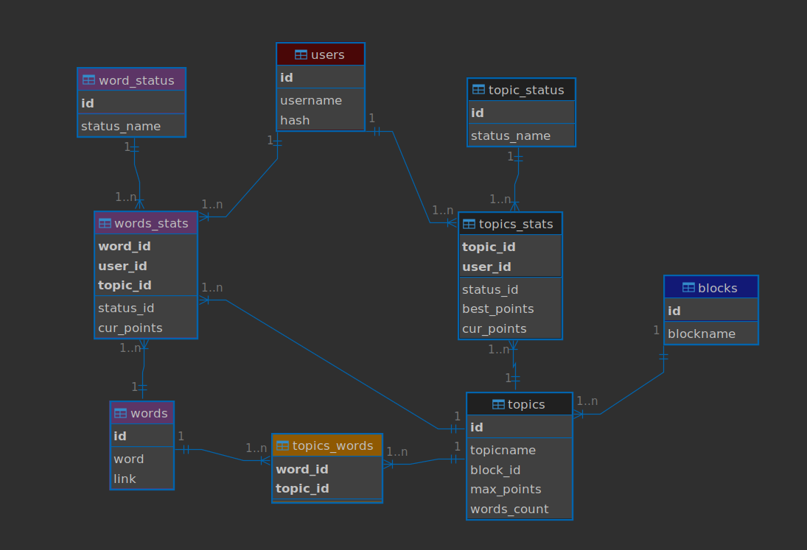

# EGNLISH SPELLING TEST WEBAPP

#### Video Demo https://youtu.be/55iRJPvU8yA
This is my final project for the [CS50’s Introduction to Computer Science](https://cs50.harvard.edu/x/2024/).

## Project file structure
+ [sql_scripts/](./sql_scripts/)
  - [001-users.sql](./sql_scripts/001-users.sql)
  - [002-blocks.sql](./sql_scripts/002-blocks.sql)
  - [003-topics.sql](./sql_scripts/003-topics.sql)
  - [004-topic-status.sql](./sql_scripts/004-topic-status.sql)
  - [005-word-status.sql](./sql_scripts/005-word-status.sql)
  - [006-words.sql](./sql_scripts/006-words.sql)
  - [007-words-stats.sql](./sql_scripts/007-words-stats.sql)
  - [008-topics-words.sql](./sql_scripts/008-topics-words.sql)
  - [009-topics-stats.sql](./sql_scripts/009-topics-stats.sql)
  - [010-trigger-on-topics-words.sql](./sql_scripts/010-trigger-on-topics-words.sql)
  - [011-triggers-on-topics-stats.sql](./sql_scripts/011-triggers-on-topics-stats.sql)
  - [012-trigger-on-words-stats.sql](./sql_scripts/012-trigger-on-words-stats.sql)
+ [src/](./src/)
  - [audio/](./src/audio/)
  - [images/](./src/images/)
  - [words/](./src/words/)
    - [Animals/](./src/words/Animals/)
      - [Birds.txt](./src/words/Animals/Birds.txt)
      - [Insects.txt](./src/words/Animals/Insects.txt)
      - [Test.txt](./src/words/Animals/Test.txt)
    - [Time/](./src/words/Time/)
      - [Days.txt](./src/words/Time/Days.txt)
      - [Months.txt](./src/words/Time/Months.txt)
+ [static/](./static/)
  - [enspell.ico](./static/enspell.ico)
  - [jquery.js](./static/jquery.js)
  - [styles.css](./static/styles.css)
+ [templates/](./templates/)
  - [apology.html](./templates/apology.html)
  - [changepwd.html](./templates/changepwd.html)
  - [congrat_topic.html](./templates/congrat_topic.html)
  - [layout.html](./templates/layout.html)
  - [login.html](./templates/login.html)
  - [portfolio.html](./templates/portfolio.html)
  - [register.html](./templates/register.html)
  - [spell_word.html](./templates/spell_word.html)
  - [word-correct.html](./templates/word-correct.html)
  - [word-not-exist.html](./templates/word-not-exist.html)
  - [word-wrong.html](./templates/word-wrong.html)
+ [test/](./test/)
  - [test_triggers.sh](.test/test_triggers.sh)
+ [app.py](./app.py)
+ [audio_downloader.py](./audio_downloader.py)
+ [get_links.py](./get_links.py)
+ [helpers.py](./helpers.py)
+ [init_update_DB.sh](./init_update_DB.sh)
+ [populateDB.py](./populateDB.py)
+ [README.md](./README.md)
+ [requirements.txt](./requirements.txt)
+ [test_get_links.py](./test_get_links.py)

## Description
English Spelling Test WebApp is a web application for checking English spelling of an updatable amount of words,\
which operates results separately for every user utilizing Flask web framework and SQLite database engine.

By execution of [init_update_DB.sh](./init_udate_DB.sh) database is initialised and populated with data taken from [words/](./src/words/),\
for every word, audio file is downloaded from wikimedia and saved under "./src/audio/".\
The same script can be used for database update (i.e. adding new words).\
For more information see [Initialising, populating and updating DB](#Initialising-populating-and-updating-DB).

After database is initialised and populated web application can be started with:
```
flask run
```

After user's registration routines finished spelling check can be started.\
Words are organized in topics, which are gathered in blocks\
(according to the file structure in "./src/words/").

> [!NOTE]
> One level nesting in *words* allowed:\
> Blocks-folders (folders: Block1, Block2 etc.),\
> which may contain any number of topics (Topic1.txt, Topic2.txt etc.).\
> Assuming each line in the file contains one word item.

Spelling goes as follows:
1) audio with pronunciation for a word is played
2) user [requests a hint] and enters his input
3) result for the spelled word is displayed.

Overall results can be seen on the main page.

### Initialising, populating and updating DB
For initialising, populating and updating DB, script [init_update_DB.sh](./init_update_DB.sh) is used.\
```
bash init_update_DB.sh DB [-init]
    DB .......... path to the DB (web app looks by default for: spelling.db)
    -init ....... enables "initialize only" mode (optional)
```
If no [-init] argument is given, populating/updating and downloading audio are performed consecutively\
(see [Populating and updating DB](#populating-and-updating-db) and [Audio resources](#audio-resources)), otherwise script exits.

#### Initialising DB
A file with the name "DB" is created if not exists,\
otherwise confirmation required for further update of DB.

For initialising, files from [sql_scripts/](./sql_scripts/) are read and executed by sqlite3 library one by one,\
so the DB with its tables and triggers is created.
See [DB structure](#db-structure) for more details.

> [!NOTE]
> sqlite3 library is needed for initialising DB.

#### Populating and updating DB
For populating or updating of DB (inserting into DB blocks, topics, words) [populateDB.py](./populateDB.py) is used.
```
usage: populateDB.py [-h] [-d BLOCKSDIR] [-db DATABASE]
options:
  -h, --help            show this help message and exit
  -d BLOCKSDIR, --blocksdir BLOCKSDIR
                        path to the directory with blocks (default: './src/words')
  -db DATABASE, --database DATABASE
                        path to the DB to be populated
```

Function **process_blocks()** loops through all BLOCKS (directories in BLOCKSDIR) and\
tries to insert the name of every BLOCK into the DB.\
DB has a block_name UNIQUE constraint:\
DB will refuse to insert a BLOCK with the name, which already exists in the DB.\
Both when new BLOCK successfully inserted or it already exists in DB, a *block_id* is obtained,\
which is used for further processing of TOPICS.

In every BLOCK, all TOPICS are processed by function **process_topics()**\
with just the same idea: to insert every TOPIC into the DB.\
But unlike for BLOCK, for TOPIC, uniqueness is defined both by *topic_name* and *block_id*\
(that means only unique pairs of topic_name and block_id are allowed in DB).\

All TOPICS processed for a BLOCK by **process_topics()** are forwarded to **process_words()**.\
TOPICS are looped through for unique WORDs (unique for processed TOPICS).\
For this list of words links to audio are obtained by [GetLinks](#getlinks).\
If link for WORD successfully obtained, WORD and link will be inserted into the DB.\
Both when WORD successfully inserted or it already exists in DB, a *word_id* is obtained,\
which is used for inserting unique pairs of *word_id* and *topic_id* into the DB.

For all interactions with the DB [execute_sql()](#execute-sql) is utilized from [helpers.py](./helpers.py).

#### Audio resources
For downloading of audio resources [audio_downloader.py](./audio_downloader.py) is used.
```
usage: audio_downloader.py [-h] [-d AUDIODIR] [-db DATABASE]
options:
  -h, --help            show this help message and exit
  -d AUDIODIR, --audiodir AUDIODIR
                        path to the directory with audio (default: './src/audio')
  -db DATABASE, --database DATABASE
                        path to the DB
```
Function **get_words()** gets all words (i.e. id, word, link for each) from DB;\
[execute_sql()](#execute-sql) from [helpers.py](./helpers.py) is used.

For every word:\
if {file_name} exists in [./src/audio/](./src/audio/), where {file_name}={id} of the word,\
word will not be downloaded,\
otherwise function **download_audio()** is executed for the word (id, word, link).

Function **download_audio()** utilizes Python standard library "requests"\
for downloading audio file by the provided link.\
File is saved as [./src/audio/{id}](./src/audio/).

#### GetLinks
See chapter [Getting wikimedia links (pronunciation)](https://github.com/serbrio/english-spelling-test/blob/master/README.md#getting-wikimedia-links-pronunciation) in docs for the project, where this class has been created.

#### DB structure
##### General description
Database along with the web app implementation are two most important parts of the project.\
A lot of things depend on how DB is designed and design of the DB is hopefully reasonable.\
This project inherits the main idea of checking spelling of English words via\
playing theirs pronuciation from the command line Python project [English Spelling Test](https://github.com/serbrio/english-spelling-test/tree/master),\
but the DB has been designed from scratch and brought several changes or even new structure\
i.e. new features into the project.

In DB there are main (strong) entities, they all have **id** as Primary Key and one ore more Attributes:
- users
- blocks
- topics
- words
- word_status
- topic_status

There are also (weak) entities representing relations between those main:
- topics_words
- topics_stats
- words_stats



See also DB diagram with highlighted ids of [users](./docs/2users.png), [topics](./docs/3topics.png), [words](./docs/4words.png).

The following entities have UNIQUE keyes along with Primary Keys:
- blocks (*blockname* is UNIQUE)
- topic_status (*status_name* is UNIQUE)
- word_status (*status_name* is UNIQUE)

The following entities have UNIQUE INDEX for faster access:
- users (UNIQUE INDEX for *username*)
- words (UNIQUE INDEX for *word*)
- topics (UNIQUE INDEX for pair of *topicname* and Foreign Key *block_id*)

##### TOPICS
Entity **topics** has Attributes:
- *words_count* (counts words in topic)
- *max_points* (represents maximum points to be achieved;\
points for a word represent length of word incl. all symbols)

DEFAULT *words_count*: 0\
DEFAULT *max_points*: 0\
Updated automatically in the DB by the TRIGGER [update_topics_and_wordsstats_after_word_insert](./sql_scripts/010-trigger-on-topics-words.sql) every time\
after insert of UNIQUE pair of *word_id* and *topic_id* into the **topics_words**.

##### TOPICS WORDS
Entity **topics_words** has the Foreign Keys *word_id* and *topic_id* as Attributes\
and a UNIQUE INDEX for this pair i.e. it contains UNIQUE pairs *word_id* and *topic_id*.\
This entity is connecting **topics** and **words** and is controlling\
that a word is present in a topic only once.

##### TOPICS STATS
Entity **topics_stats** has the Foreign Keys *topic_id* and *user_id* as Attributes\
with a UNIQUE INDEX for this pair thus containing UNIQUE pairs *topic_id* and *user_id*\
and connecting **topics** and **users** so that a user can have only one recording for a topic.

Through the Foreign Key *status_id* the entity is connected with the **topic_status**,\
which is barely a list of status names: "STARTED", "DONE".\
DEFAULT: "STARTED".

There are also Attributes *best_points* and *cur_points* in **topics_stats**.\
DEFAULT *best_points*: 0\
DEFAULT *cur_points*: 0\
Updated automatically in the DB by TRIGGERS:
1) [update_words_status_NA_topics_curpts_0_after_topic_status_STARTED](./sql_scripts/011-triggers-on-topics-stats.sql)\
When status of topic in **topics_stats** is UPDATED to "STARTED",\
*cur_points* in **topics_stats** gets value "0".
2) [update_best_points_after_status_DONE](./sql_scripts/011-triggers-on-topics-stats.sql)\
When status of topic in **topics_stats** is UPDATED to "DONE"\
and in **topics_stats** *cur_points* are bigger than *best_points*,\
*best_points* are UPDATED i.e. get value of *cur_points*.
3) [update_topic_cur_points_after_word_status_OK](./sql_scripts/012-triggers-on-words-stats.sql)\
When status of a word in **words_stats** is UPDATED to "OK",\
and some points for a word achieved (i.e. *cur_points* in **words_stats** not "0"),\
*cur_points* achieved for the word are added to the *cur_points* of the topic.

##### WORDS STATS
Entity **words_stats** has the Foreign Keys *word_id*, *topic_id* and *user_id* as Attributes\
with a UNIQUE INDEX for this triplet thus containing those UNIQUE triplets\
and connecting entities **words**, **topics** and **users** so that\
a user can have only one recording for a word in a topic.

When a new pair of word and topic appears in **topics_words**,\
*word_id*, *topic_id*, *user_id* are INSERTED into **words_stats** automatically\
by the TRIGGER [update_topics_and_wordsstats_after_word_insert](./sql_scripts/010-trigger-on-topics-words.sql).

The Foreign Key *status_id* connects the entity with the **word_status**,\
which is barely a list of status names: "N/A", "OK", "FAILED".\
DEFAULT: "N/A".

Attribute *cur_points*\
DEFAULT: "0".

When status of topic in **topics_stats** is UPDATED to "STARTED",\
*status_id* and *cur_points* in **words_stats** are updated automatically\
by the TRIGGER [update_words_status_NA_topics_curpts_0_after_topic_status_STARTED](./sql_scripts/011-triggers-on-topics-stats.sql),\
i.e. for every word in the STARTED topic to DEFAULT values are set:\
*status_id* to 1("N/A"), *cur_points* to "0".

##### SUMMARY ON TRIGGERS
1) When a UNIQUE pair of word and topic appears (in **topics_words**),\
*words_count* and *max_points* are UPDATED for this topic in **topics**,\
word is inserted into **words_stats** for those users, which have ever started this topic\
(i.e. *word_id*, *topic_id*, *user_id* are inserted into **words_stats**).\
See "update_topics_and_wordsstats_after_word_insert" in [010-trigger-on-topics-words.sql](./sql_scripts/010-trigger-on-topics-words.sql).
2) When topic is "STARTED" for the first time\
(i.e. UNIQUE pair of *topic_id* and *user_id* appears in **topics_stats**),\
all words for this topic are inserted into **words_stats** with DEFAULT values.\
See "update_words_status_after_topics_stats_insert" in [011-triggers-on-topics-stats.sql](./sql_scripts/011-triggers-on-topics-stats.sql).
3) When topic is "STARTED"\
(i.e. *status_id* of topic is changed to "1" in **topics_stats**),\
*cur_points* of topic (in **topics_stats**) is reset to DEFAULT value "0",\
*cur_points* of word (in **words_stats**) is reset to DEFAULT value "0",\
*status_id* of word (in **words_stats**) is reset to DEFAULT value "1" ("N/A").\
See "update_words_status_NA_topics_curpts_0_after_topic_status_STARTED" in [011-triggers-on-topics-stats.sql](./sql_scripts/011-triggers-on-topics-stats.sql).
4) When topic is "DONE"\
(i.e. *status_id* of topic is changed to "2" in **topics_stats**)\
and when user achieved more points for topic than ever\
(i.e. *cur_points* are bigger than *best_points* in **topics_stats**),\
*best_points* get value of *cur_points*.\
See "update_best_points_after_status_DONE" in [011-triggers-on-topics-stats.sql](./sql_scripts/011-triggers-on-topics-stats.sql).
5) When all words for a topic get status "OK" or "FAILED"\
(i.e. *status_id* in **words_stats** of a word UPDATED and not "1"\
and *status_id* of all words in this topic also not "1"),\
status of topic is changed to "DONE" (i.e. *status_id* changed to "2" in **topics_stats**).\
See "update_topics_status_to_DONE_after_words_status_update" in [012-triggers-on-words-stats.sql](./sql_scripts/012-triggers-on-words-stats.sql).
6) When status of word updated to "OK" (i.e. *status_id* set to "2" in **words_stats**)\
and some points for the word achieved (i.e. *cur_points* not "0" in **words_stats**),\
*cur_points* achieved for the word are added to the *cur_points* of the topic.\
See "update_topic_cur_points_after_word_status_OK" in [012-triggers-on-words-stats.sql](./sql_scripts/012-triggers-on-words-stats.sql).

TRIGGERS automate a lot of work releasing web app from doing it.

### Web App
Below are described routes used in Flask web app,\
which present logic of application:\
render appropriate HTML templates, interact with DB, guide user.

#### Root
Route "/"
GET info from SQL -> render [portfolio](#portfolio)

GET request to the root of the web app initiates collectiong of\
all information for the user from the DB ([login required](#Routes-decorator-login-required)),\
which is required for rendering [portfolio](#portfolio),\
and rendering of user's portfolio.

Route allows to use the path "/highlighted/<id>", which is used to 'highlight'\
a topic by rendering portfolio of a user.

#### Login
Route "/login"
GET -> render [login.html](./templates/login.html)

POST
- return [apology](#function-apology), if username/password missing
- get user_id from DB
  - return [apology](#function-apology), if username/pwd wrong
  - set session's user_id -> redirect to "/"

#### Logout
Route "/logout"
Logs out user (clears session) and redirects to "/".

#### Register
Route "/register"
GET -> render [register.html](./templates/register.html)

POST
- return [apology](#function-apology),\
if username/password missing or username exists or password not confirmed
- generate hash for password, insert username, hash into DB -> redirect to "/login"

#### Changepwd
Route "/changepwd"
GET -> render [changepwd.html](./templates/changepwd.html)

POST
- return [apology](#function-apology),\
if current/new passwords not provided, current password wrong or new password not confirmed
- update hash in DB -> redirect to "/"

#### Spelling
Route "/spelling"
GET   -> redirect to "/"

POST
- redirect to "/", if no topic_id provided
- get info on topic stats from DB
  - if no info -> insert topic into DB (*topic_id*, *user_id* into **topics_stats**)
  - if there is info:
    - update *topic_status* to "STARTED" in DB, if *topic_status* = "DONE" and "REDO"
    - redirect "/highlighted/<topic_id>", if *topic_status* is "DONE" but not "REDO"
    - get random not spelled word from DB
      - return [apology](#function-apology), if no word found
      - update **words_stats** set *cur_points* to "0" -> render [spell_word.html](#spell-word)

#### Hint
Route "/hint"
GET
- return [apology](#function-apology), if no *word_id* or *topic_id* provided
- get *word*, *cur_points* from DB (from **words** and **words_stats**)
  - return [apology](#function-apology), if word not found
  - update *cur_points* -= 1 in DB **words_stats**, [generate](#generate-a-hint) and return hint,

#### Spelled
Route "/spelled"
POST
- if *topic_id*, *word_id*, *topicname*, *blockname* not provided -> return [apology](#function-apology)
- get *word* from DB
  - render [word-not-exist.html](./templates/word-not-exist.html), if word does not exist in DB
  - render [word-wrong.html](./templates/word-wrong.html), update DB (set *status_id* to "FAILED" in **words_stats**), if word spelled wrong
  - render [word-correct.html](./templates/word-correct.html), update DB (set *status_id* to "OK", update *cur_points* in **words_stats**), if word spelled correctly

> [!NOTE]
> When hint is requested, 1 is subtracted from *cur_points*.\
> Thus, update of *cur_points* when word is spelled correctly is nothing but:\
> length of word + *cur_points*.

#### Audio
Route "/audio/<'id'>"
GET request to this route gets audio sent from [audio](./src/audio/).\
See [Spell word](#spell-word).

#### Images
Route "/images/<'id'>"
TODO: Idea is to show illustrative pictures for words.

### HTML Templates
HTML templates, which are used for rendering data in web browser.
JINJA is used as template engine.

#### Layout
The basic HTML template [layout.html](./templates/layout.html)
includes interactive references to the following web app's routes:
+ /
+ /changepwd
+ /logout
+ /register
+ /login

Layout.html is enxtended by all other templates.

#### Spelling result
The following templates allow not only to interact with user\
(send request to the route "/" when button "Stop" pushed),\
but also to pass some arguments (topic_name, block_name, topic_id)\
in request to the route "/spelling" when button "Next word" pushed:
+ [word-correct.html](./templates/word-correct.html)
+ [word-not-exist.html](./templates/word-not-exist.html)
+ [word-wrong.html](./templates/word-wrong.html)

#### Portfolio
The template [portfolio.html](./templates/portfolio.html) uses data aggregated on the server side for the current user:
+ blocks (name, id)
+ topics (name, id)
+ topics' statuses by id (STARTED, DONE)
+ amount of words in every topic
+ maximum number of points available to achive for topic
+ current number of points achieved for every topic
+ best number of points achieved ever for topic
+ highlighted (id of topic to be highlighted)

It loops (i.e. template engine does) through every topic in every block\
and depending on the topic's data (status, maximum/current number of points, highlighted or not)\
represents every topic correspondingly:
+ if topic has **no status**, it will be in grey color
+ if topic has status **DONE**, but is not highlighted, it will be in green color
+ if topic has status **DONE** and is highlighted, it will be in green color and blinking
+ if topic has status **STARTED**, it will be in yellow color

Additional info about the highlighted (which only **DONE** topics can be):\
depending on the fact if **maximum** available points achived\
different messages can be shown ("Super" or "You can do better").

For every topic there is a tooltip available.
Tooltip shows **words amount** in topic.\
Plus depending on topic's data tooltip shows some statistics:
+ **no status** -> **0** of **maximum** available points
+ **STARTED**, but has not achieved ever any points -> **current** of **maximum** points
+ **STARTED** and has achieved ever any points -> **current and best** of **maximum** points
+ **DONE** -> **best** of **maximum** available points

Additionally, for every topic except for those without status a progress bar is shown:
+ **STARTED** -> ratio of the **current** number of points to the **maximum**
+ **DONE** -> ratio of the **best** ever achieved number of points to the **maximum**

#### Spell word
The template [spell_word.html](./templates/spell_word.html)
passes arguments (topic_name, block_name, topic_id, word_id)\
in request to the route "/spelled" when button "OK" pushed\
or arguments (word_id, topic_id) to the route "/hint" when button "Hint" pushed,\
or sends request to the route "/" when button "Stop" pushed,\
or plays audio (word pronunciation), when button "Play" or "Hint" pushed or document loaded.

Within this HTML template **JavaScript** is utilized.\
Function playById() allows to play audio located on *{web app server}/audio/{word_id}*.\
**Ajax** is utilized in a function (which is called on document ready)\
for asynchronous interaction with the web app - for getting hints when button "Hint" pushed:\
within request to *{web app server}/hint* arguments are passed (word_id, topic_id).

#### Other
The following templates are very basic ones and need no exceptional comment,\
these allow to interact with user and accept some data from him (like input submission):
+ [register.html](./templates/register.html) (request to route "/register"),
+ [login.html](./templates/login.html) ("/login"),
+ [logout.html](./templates/logout.html) ("/logout"),
+ [changepwd.html](./templates/changepwd.html) ("/changepwd"),
+ [apology.html](./templates/apology.html) (shows image with the given message).

### Helpers

#### Dict factory
Funciton dict_factory() is a helper function for the function execute_sql().\
It accepts the cursor and the original row as a tuple from sqlite3 connection\
and returns result as a dictionary.

#### Execute SQL
Function execute_sql() interacts with DB: gets data or makes updates.\
Opens connection to SQLile DB, executes sql statement,\
auto-commits changes and auto-closes connection.

The 'params' are to bind with placeholders in the statement.\

Returns tuple of data and lastrowid:
+ when getting data from DB returns list of dictionaries containing requested data and 0;

+ when updating DB returns empty list and 0;

+ when inserting data into DB returns empty list and ID of the lastrow.

#### Generate a hint
Function generate_hint(word, i) returns a hint for a **word** -\
a string containing **i** letters of the word beginning with the first one,\
and the stars "*" as placeholders for the remaining letters.

Examples:
```
>>> give_hint("owl", 1)
"o**"
>>> give_hint("tomato", 3)
"tom***"
>>> give_hint("a cat", 2)
"a ***"
```
#### Function apology
This function is borrowed from CS50x Week 9 Flask
problem set [example code](https://cdn.cs50.net/2024/x/psets/9/finance/helpers.py).

#### Routes decorator: login required
This decorator is borrowed from CS50x Week 9 Flask
problem set [example code](https://cdn.cs50.net/2024/x/psets/9/finance/helpers.py).

### Problems and plans
1. BUG: **words_stats** not updated when adding new words into **topics_words**.\
When updating DB i.e. adding new pair of word, topic into topics_words\
(inserting *word_id*, *topic_id* into **topics_words**),\
info in **words_stats** was not updated.\
It was critilal for those topics, which has been ever started by a user:\
theirs info got updated in **topics** (i.e. *words_count*, *max_points* updated in **topics**),\
but was not updated in **words_stats** (i.e. record with new *word_id* was missing).\
STATE: RESOLVED\
SOLUTION:\
to the TRIGGER "update_topics_and_wordsstats_after_word_insert" in [010-trigger-on-topics-words.sql](./sql_scripts/010-trigger-on-topics-words.sql)\
added the action of INSERT a new recording of *word_id*, *topic_id* into **words_stats** \
for those users (by *user_id*) which ever started this topic\
(i.e. which already have this topic in **words_stats**).

2. TODO: show images illustrating words
3. TODO: add animation/sparkles onto result html
4. TODO: autologin after registration
5. TODO: use execute_many_sqls() instead of execute_sql(); to be found in [helpers.py](./helpers.py).
6. TODO: add to (i) tooltip amount of words not spelled, when topic is STARTED

### External Python libraries used
[Flask](https://pypi.org/project/Flask/)
[Flask-Session](https://pypi.org/project/Flask-Session/)
[pytz](https://pypi.org/project/pytz/)
[requests](https://pypi.org/project/requests/)
[sqlite3](https://pypi.org/project/SQLite3-0611/)
[wkt_scraper](https://pypi.org/project/wkt-scraper/)

### Resources used when running English Spelling Test WebApp
[Wiktionary](https://en.wiktionary.org/wiki/Wiktionary:Main_Page)
[Wikimedia Commons](https://commons.wikimedia.org/wiki/Main_Page)
